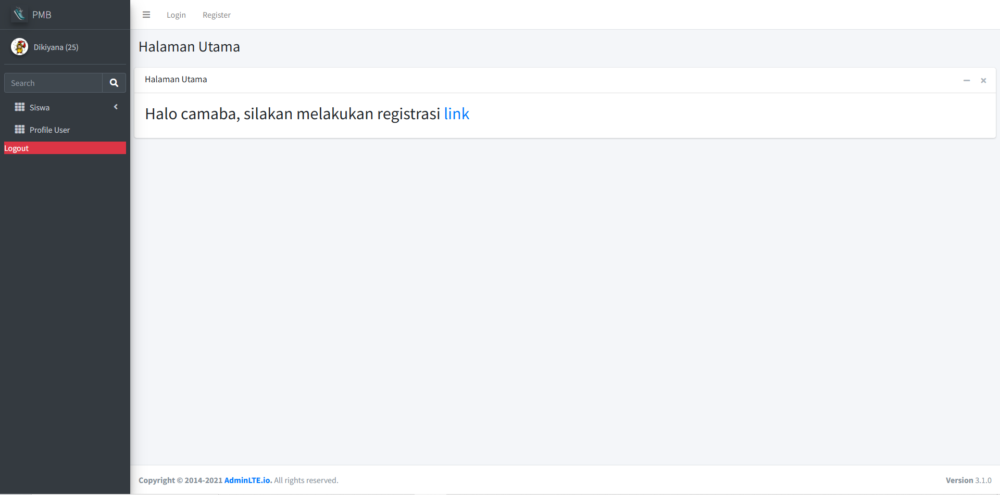
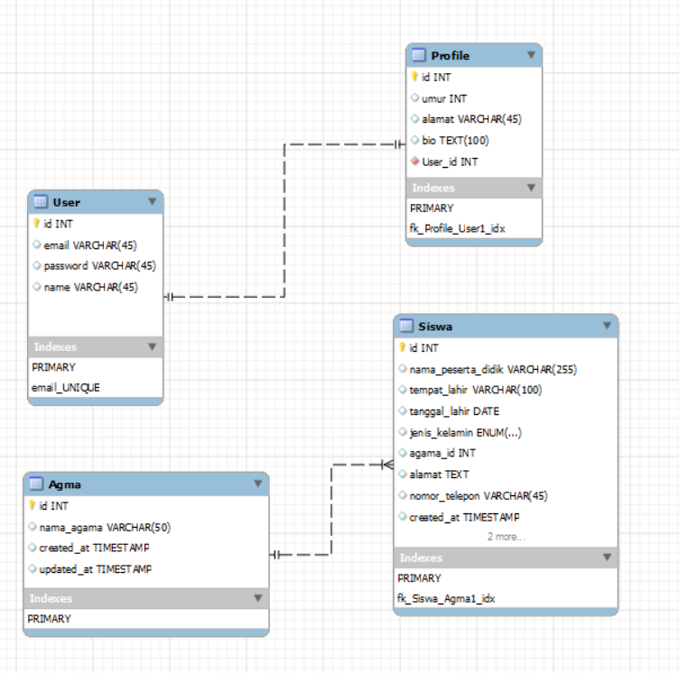

## 🖼️ User Interface (UI) Preview


## 📂 Entity Relationship Diagram (ERD)



<h2 align="center">📰 PMB Siswa</h2>

This project is a simple web application for Penerimaan Mahasiswa Baru (PMB) built using the Laravel framework. The application helps manage the registration and admission process of new students in an educational institution.

It includes modules to handle applicant data such as personal identity, religion, gender, contact information, and other relevant admission details. The system follows Laravel's MVC architecture and best practices to ensure clean and maintainable code..

An ERD (Entity Relationship Diagram) is provided in the project to better understand the database schema and relationships among the entities.

---

## 🔧 Built With

This Laravel-based application includes:
- **PHP** - 8.0.12
- **Migration** – Manage and version-control the database schema
- **Model & Eloquent ORM** – Interact with the database using elegant syntax
- **Controller** – Handle request logic and connect models to views
- **Laravel Auth & Middleware** – User authentication and role-based access control
- **Blade View** – Templating engine for rendering dynamic HTML pages
- **CRUD** – Full Create, Read, Update, Delete operations for resources
- **Eloquent Relationships** – Define relationships like one-to-many and many-to-many

---

## 🚀 Installation Guide

Follow the steps below to run this project locally:

### 1. Clone the Repository

```bash
git clone https://github.com/dikiyana/PMB.git
cd menit
```

### 2. Install Dependencies

```bash
composer install
npm install && npm run dev
```

### 3. Set Up Environment File

```bash
cp .env.example .env
php artisan key:generate
```

Edit `.env` file to match your local database configuration.

### 4. Run Migrations

```bash
php artisan migrate
```

### 5. (Optional) Seed the Database

```bash
php artisan db:seed
```

### 6. Start the Laravel Development Server

```bash
php artisan serve
```

Visit [http://localhost:8000](http://localhost:8000) in your browser.

---


## 📜 License

This project is open-source and licensed under the [MIT License](https://opensource.org/licenses/MIT).